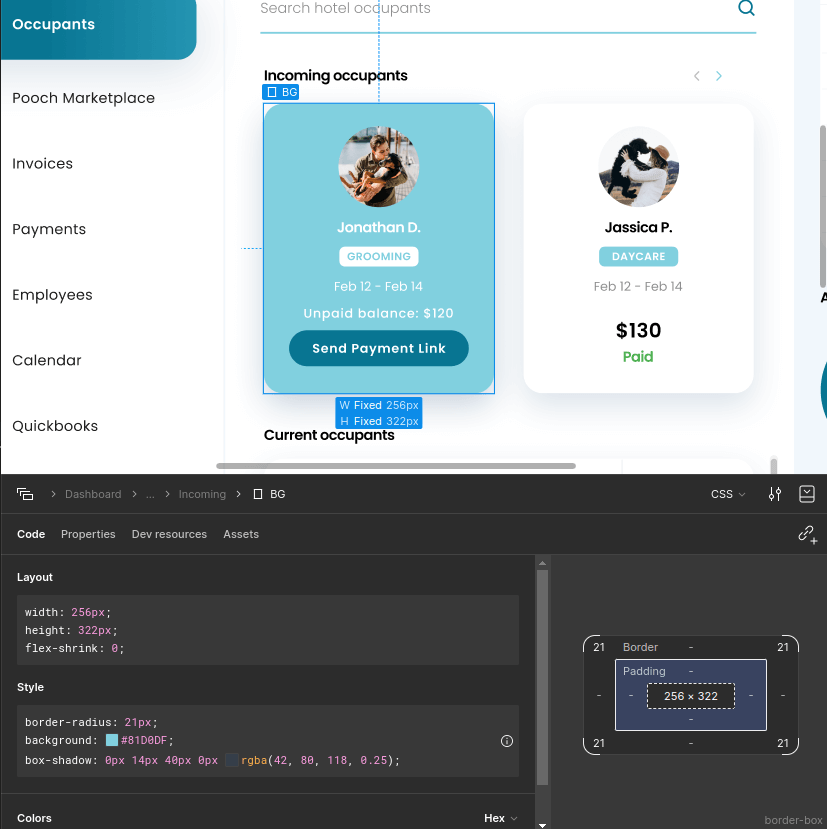

# unocss-preset-calc

unocss-preset-calc is a [UnoCSS](https://unocss.dev/) plugin for working with the CSS calc property.



```html
<!-- Your html -->
<section>
  <div class="w-256 h-322 rounded-21 bg-sky-400 ...">
    <!-- another html tag -->
  </div>
  <div class="w-256 h-322 rounded-21 ...">
    <!-- another html tag -->
  </div>
</section>
```

```css
/* css output */
.w-256 {
  width: calc(256 * clamp(0px,100vw,1920px) / var(--width-screen));
}
.h-322 {
  height: calc(322 * clamp(0px,100vw,1920px) / var(--width-screen));
}
.rounded-21 {
  border-radius: calc(21 * clamp(0px,100vw,1920px) / var(--width-screen));
}
```

## Instalation

```bash
npm i unocss-preset-calc -D # with npm
yarn add unocss-preset-calc -D # with yarn
pnpm add unocss-preset-calc -D # with pnpm
```

```css
/* main.css */
:root {
  --width-screen: 375
}

@media screen (min-width: 768px) {
  :root {
    --width-screen: 1920
  }
}
```

```typescript
// unocss.config.js
import { presetUno, defineConfig } from 'unocss'
import { presetCalc } from 'unocss-preset-calc'

export default defineConfig({
  presets: [
    presetUno(),
    presetCalc({ /** options */}),
  ],
})
```

## Preset Options
```typescript
interface Options {
  /**
   * @default 0
   */
  min?: number
  /**
   * @default 1920
   */
  max?: number
  /**
   * @default '--width-screen'
   */
  CSSglobalVar?: string
}
```